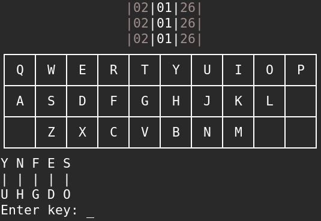
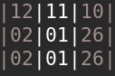
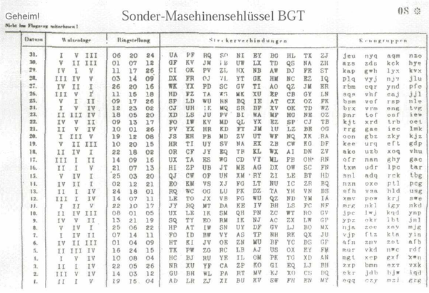

# Enigma Machine

This is a simple project to emulate the 🔡 **Enigma Machine** 🔒 use Python 3

> The **Enigma machine** is an [encryption](https://en.wikipedia.org/wiki/Encryption "Encryption") device developed and used in the early- to mid-20th century to protect commercial, diplomatic and military communication. It was employed extensively by [Nazi Germany](https://en.wikipedia.org/wiki/Nazi_Germany "Nazi Germany") during [World War II](https://en.wikipedia.org/wiki/World_War_II "World War II"), in all branches of the German military.
>
> ---- _by [ Wikipedia](https://en.wikipedia.org/wiki/Enigma_machine)_

# Use

### Required

-   [terminaltables](https://pypi.org/project/terminaltables/)

-   [colorclass](https://pypi.org/project/colorclass/)

```bash
python3 enigma.py
```

# Explain

<p><a href="https://commons.wikimedia.org/wiki/File:Enigma_(crittografia)_-_Museo_scienza_e_tecnologia_Milano.jpg#/media/File:Enigma_(crittografia)_-_Museo_scienza_e_tecnologia_Milano.jpg"></a><br>By Alessandro Nassiri - <a href="https://en.wikipedia.org/wiki/en:Museo_Nazionale_Scienza_e_Tecnologia_Leonardo_da_Vinci" class="extiw" title="w:en:Museo Nazionale Scienza e Tecnologia Leonardo da Vinci">Museo della Scienza e della Tecnologia "Leonardo da Vinci"</a>, <a href="https://creativecommons.org/licenses/by-sa/4.0" title="Creative Commons Attribution-Share Alike 4.0">CC BY-SA 4.0</a>, <a href="https://commons.wikimedia.org/w/index.php?curid=47910919">Link</a></p>

### 1. Use 😎



Press any key and the character change color in the light-board (on real model, it's all the blub 💡 with characters) which is the encryt 🔡 result

on top of the board is roto, in the real Enigma machine, there only one number show out of the box, but I tried to make it's look like a ring :3



above of the light-board is Plug board, but if you don't plug anything, There're just input keyboard here. Don't worry about the message, you don't need plug to use this Enigma machine 😙

### 2. Plug board 🔌

> ...
>
> **The plugboard contributed more cryptographic strength than an extra rotor.**
>
> ...
>
> A cable placed onto the plugboard connected letters in pairs; for example, _E_ and _Q_ might be a steckered pair. The effect was to swap those letters before and after the main rotor scrambling unit. For example, when an operator pressed _E_, the signal was diverted to _Q_ before entering the rotors. Up to 13 steckered pairs might be used at one time, although only 10 were normally used.
>
> ---- _by [Wikipedia](https://en.wikipedia.org/wiki/Enigma_machine#Plugboard)_

### 3. Ring settings 👌

> The rotors (alternatively _wheels_ or _drums_, _Walzen_ in German) form the heart of an Enigma machine.
>
> ---- _by [Wikipedia](https://en.wikipedia.org/wiki/Enigma_machine#Rotors)_

so if you've read the article in [Wikipedia](https://en.wikipedia.org/wiki/Enigma_machine) you should see that the roto have diffrent way to show up their value, diffrence by models. But all of them can be set up.

To setup in the real model, I think you gonna want to shift it by hand ✋. In this Enigma Machine all you need to do is enter the value which the shift times of each rings. Notice that the rotos in this python model show vertically from top to bottom ⏬ (in the real model it horizontally, from left to right ➡️ ).

### 4. Custom roto wiring 🔀

> The mechanical parts act by forming a varying [electrical circuit](https://en.wikipedia.org/wiki/Electrical_network "Electrical network"). When a key is pressed, one or more rotors rotate on the spindle. On the sides of the rotors are a series of electrical contacts that, after rotation, line up with contacts on the other rotors or fixed wiring on either end of the spindle. When the rotors are properly aligned, each key on the keyboard is connected to a unique electrical pathway through the series of contacts and internal wiring.
>
> ---- by [Wikipedia](https://en.wikipedia.org/wiki/Enigma_machine#Electrical_pathway)

So that custom wiring is the things that in fact soilders never do 😿. Because it's built in randomly and depends on what model of the Enigma Machine. Howerver _I want to make it a little more interesting, so I add this function._

Basically, when you press A in the keyboard, the wiring lead you to another port of next roto (for example in Z port of the next, and the Z port go to the E for example and so on). So the setting gonna be "Z..." and "...E" because **Z gonna be next cypher infomation for the A** and **E gonna be next cypher infomation for the Z**. For example with this setting:

> LUSHQOXDMZNAIKFREPCYBWVGTJ

a given machine configuration will encoded A to L, B to U, C to S, ..., and Z to J.

By default, the wiring of this Enigma Machine is the wiring of [Commercial 💰 Enigma](https://en.wikipedia.org/wiki/Enigma_machine#Commercial_Enigma) which I think the simplest. You can take a look of [details about roto](https://en.wikipedia.org/wiki/Enigma_rotor_details) for better explain and [Roto wiring tables 🔀](https://en.wikipedia.org/wiki/Enigma_rotor_details#Rotor_wiring_tables) for another model's wiring.

### 5. Codebook 📖

> A codebook is a type of document used for gathering and storing cryptography codes. Originally codebooks were often literally books, but today codebook is a byword for the complete record of a series of codes, regardless of physical format.
> by [Wikipedia](https://en.wikipedia.org/wiki/Codebook)

so if you want to set up your enigma machine like a soilder, take a look at this page of codebook


| Date                                                              | Ignore                                                     | Rings settings                           | Plug board settings                                                                                                                    | Ignore too |
| ----------------------------------------------------------------- | ---------------------------------------------------------- | ---------------------------------------- | -------------------------------------------------------------------------------------------------------------------------------------- | ---------- |
| Date of the month 📆<br/> For each day, we have diffrent settings | we don't have this setting 😅<br/>cuz we just have 3 rotos | The shifting value<br/>of rings by order | With a pair of characters, it's mean you should plug 🔌 them together.<br/> In this machine, you just need to type all **one by one**. | 😅         |

**Hope you have fun with it! ❤️**
